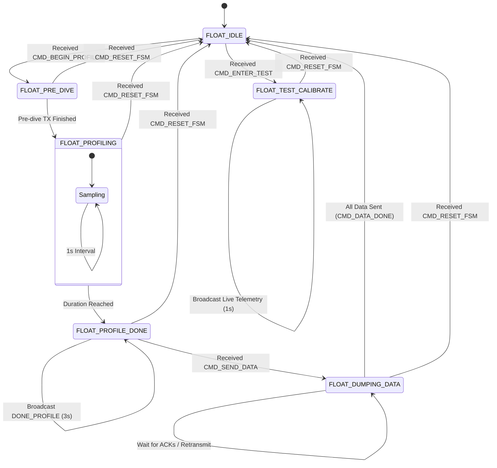
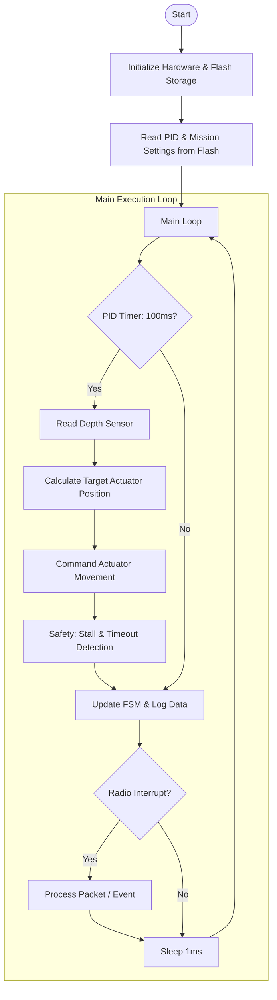

# Float Unit (Underwater) Architecture

This document describes the software architecture for the underwater float, including its state machine and main loop execution flow.

---

## 1. Float FSM (State Transitions)

The Float FSM manages the mission lifecycle, from waiting for surface commands to executing the dive profile and surfacing to transfer data.

---

## 2. Float Program Flow (Main Loop)

The main loop in `src/float_main.c` executes periodic tasks like PID control and safety checks.

---

## 3. Implementation Details

- **Safety Overrides**: The float implements non-blocking actuator control with a 1-second stall detection and 8-second timeout to protect the hardware.
- **Persistent Storage**: All mission parameters (PID constants, actuator bounds, etc.) are saved to the internal flash using LittleFS.
- **Checksum Verification**: Every incoming packet is validated using a CRC-8/XOR checksum defined in `packets.h`.
- **Forced Resets**: The `CMD_RESET_FSM` command allows the operator to manually override the state machine and return it to `IDLE`.
