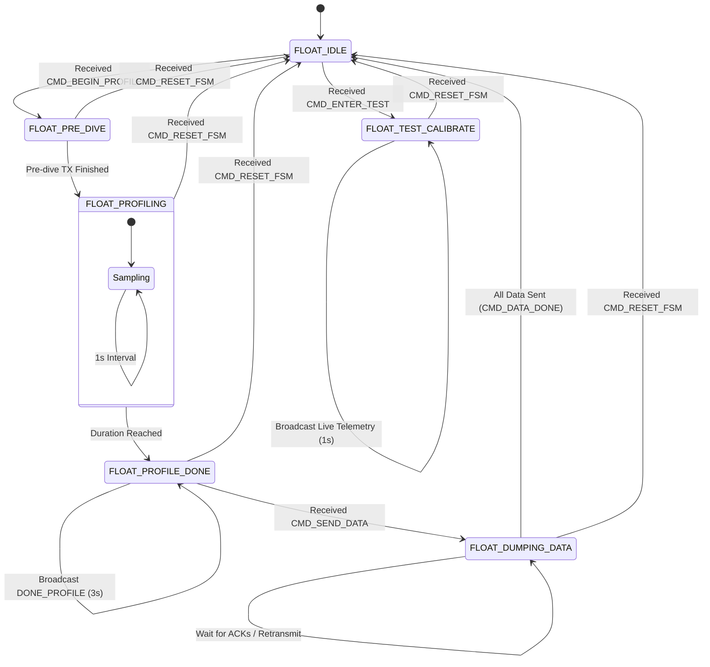
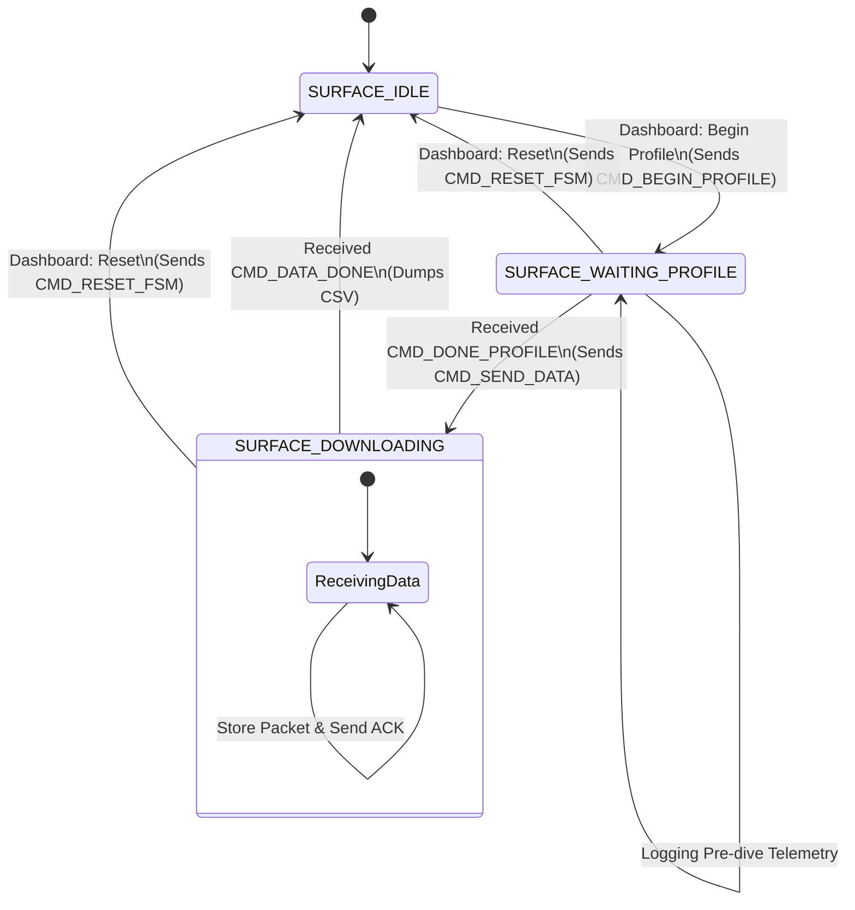

# Finite State Machine (FSM) Architecture

This document describes the state machine logic for both the Float (Underwater Unit) and the Surface Station (Command & Control). 

## 1. Float FSM (Autonomous Underwater Unit)

The Float FSM manages the mission lifecycle, from waiting for surface commands to executing the dive profile and surfacing to transfer data.

### Float State Descriptions
- **FLOAT_IDLE**: The default state. Listens for mission commands and configuration updates (PID, Actuator Bounds, etc.).
- **FLOAT_PRE_DIVE**: Briefly transmits a pre-dive packet to notify the surface that the mission has started.
- **FLOAT_PROFILING**: The active dive phase. The float remains radio-silent while sampling depth data and executing PID control for buoyancy management.
- **FLOAT_PROFILE_DONE**: Mission duration complete. The float surfaces and broadcasts `DONE_PROFILE` to announce it is ready for data recovery.
- **FLOAT_DUMPING_DATA**: Sequentially transmits all recorded profile samples to the surface, waiting for an `ACK` for each packet.
- **FLOAT_TEST_CALIBRATE**: A special diagnostic mode that streams live depth and actuator telemetry at 1Hz for tuning and testing.

---

## 2. Surface Station FSM (Recovery & Control)

The Surface Station FSM coordinates the mission stages and handles data logging from the float.

### Surface State Descriptions
- **SURFACE_IDLE**: Monitoring state. Used to sync settings and issue commands from the Streamlit dashboard.
- **SURFACE_WAITING_PROFILE**: The station waits for the float to complete its mission. Listens for the `DONE_PROFILE` signal.
- **SURFACE_DOWNLOADING**: Active data recovery phase. Uses a Stop-and-Wait protocol to receive and acknowledge every recorded sample from the float.

### Reliability Mechanisms
- **Stop-and-Wait ARQ**: Used during `SURFACE_DOWNLOADING` to ensure every packet is received without corruption or loss.
- **Checksum Verification**: Every packet is validated using a CRC-8/XOR checksum defined in `packets.h`.
- **Forced Resets**: The `CMD_RESET_FSM` command allows the operator to manually override either state machine and return them to `IDLE`.
