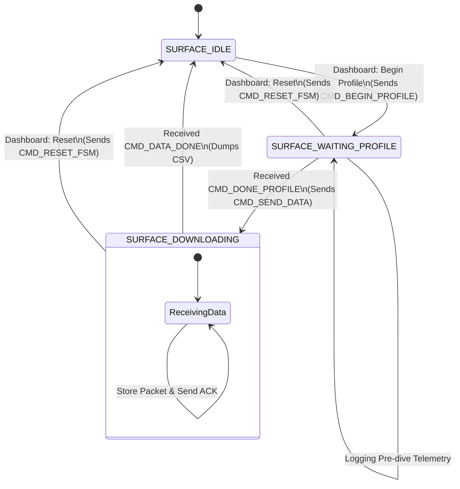
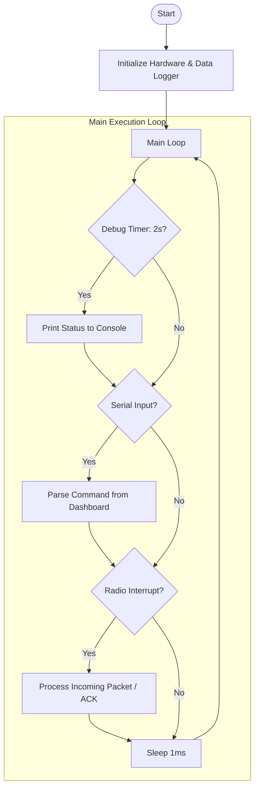

# Surface Station Architecture

This document describes the software architecture for the surface station, including its state machine and main loop execution flow.

---

## 1. Surface FSM (State Transitions)

The Surface Station FSM coordinates the mission stages and handles data logging from the float.

---

## 2. Surface Program Flow (Main Loop)

The main loop in `src/surface_main.c` manages communications between the radio and the Streamlit dashboard.

---

## 3. Implementation Details

- **Reliability Mechanism**: Uses a **Stop-and-Wait ARQ** protocol during `SURFACE_DOWNLOADING` to ensure every mission sample is received without corruption or loss.
- **Serial Protocol**: Communicates with the Streamlit dashboard using a single-character command protocol over USB-Serial.
- **Data Logging**: Received samples are stored in RAM and dumped to a CSV-compatible format in the console when the mission is complete.
- **Forced Resets**: The `CMD_RESET_FSM` command allows the operator to manually override the surface station's state and return it to `IDLE`.
