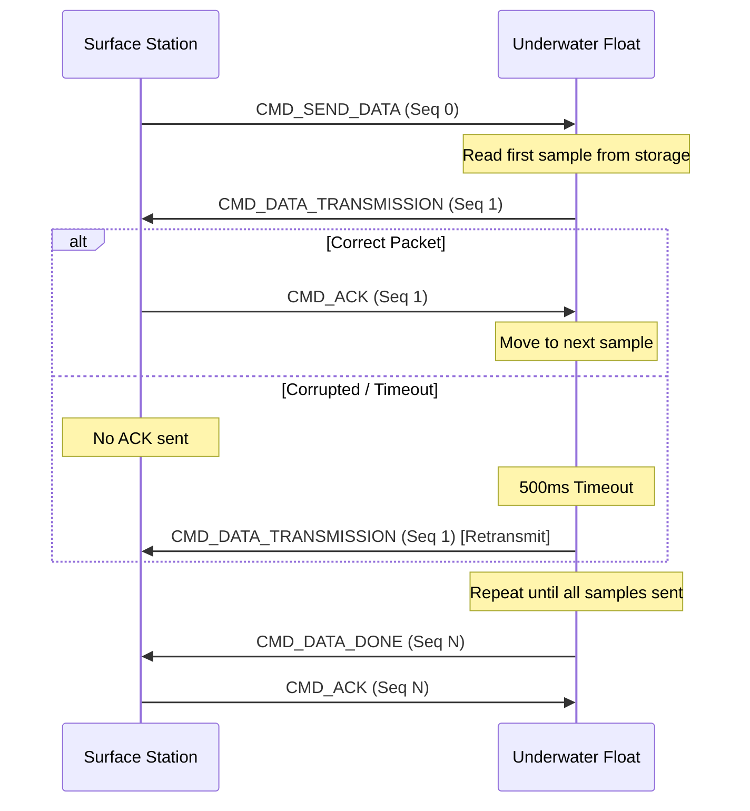

# Communication Protocol

This document defines the wireless and serial communication protocols used by the X18-Float system for telemetry, settings synchronization, and data transfer.

---

## 1. Wireless Packet Structure (`packet_t`)

The float and surface station communicate using a fixed-size 32-byte packet structure defined in `lib/comms/packets.h`. 

| Offset | Field | Type | Description |
| :--- | :--- | :--- | :--- |
| 0 | `command` | `uint8_t` | Command or message type (see Command Codes) |
| 1-2 | `seq_num` | `uint16_t` | Sequence number for tracking and ACKs |
| 3-26 | `payload` | `union` | Command-specific data (24 bytes max) |
| 31 | `checksum` | `uint8_t` | CRC-8/XOR checksum of bytes 0-30 |

### Payload Formats
- **Telemetry**: `company_number` (u16), `time_ms` (u32), `depth_m` (float).
- **Settings**: `kp`, `ki`, `kd` (float), `company_number` (u16), `duration_s` (u16), `actuator_target` (u16), `current_pos` (u16), `act_min/max` (u16).

---

## 2. Serial / CLI Protocol

The float and surface station expose a serial console for direct operator interaction and dashboard integration.

### Inbound Commands (Operator -> Device)
| Command | Parameter | Description |
| :--- | :--- | :--- |
| `p` | None | **Begin Profile**: Starts the autonomous mission. |
| `?` | None | **Sync**: Requests current device state and settings. |
| `z` | None | **Zero Depth**: Calibrates the current pressure as 0.0m. |
| `a` | `<pos>` | **Set Actuator**: Manually move actuator to ADC counts (0-4095). |
| `b` | `<min> <max>`| **Set Bounds**: Update safety soft-limits for the actuator. |
| `s` | `
 <i> <d>`| **Set PID**: Update depth control gains. |
| `r` | None | **Reset**: Forces the State Machine back to IDLE. |

### Outbound State Sync (`[SYNC]`)
Used by the Mission Control Dashboard to update UI elements.
**Format:** `[SYNC] P=<f> I=<f> D=<f> Co#=<u> Time=<u> Off=<f> ADC=<u> ActMin=<u> ActMax=<u>`

---

## 3. Reliability: Stop-and-Wait ARQ

During high-volume data transfer (e.g., mission data dumps), the system uses a **Stop-and-Wait Automatic Repeat Request (ARQ)** mechanism to ensure every packet is received correctly.

---

## 4. Data Integrity

Every packet ends with a **XOR Checksum**. If the received checksum does not match the calculated one, the packet is discarded and an ACK is NOT sent, triggering a retransmission.
