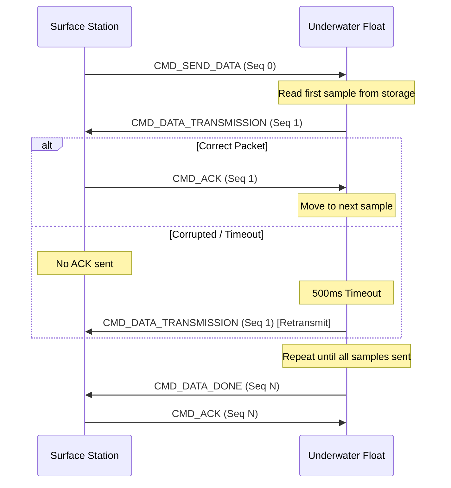

# Communication Protocol

This document defines the wireless and serial communication protocols used by the X18-Float system for telemetry, settings synchronization, and data transfer.

---

## 1. Wireless Packet Structure (`packet_t`)

The float and surface station communicate using a fixed-size 32-byte packet structure defined in `lib/comms/packets.h`. This ensures deterministic processing and minimizes overhead.

### Packet Layout

| Offset | Field | Type | Description |
| :--- | :--- | :--- | :--- |
| 0 | `command` | `uint8_t` | Command or message type (see Command Codes) |
| 1-2 | `seq_num` | `uint16_t` | Sequence number for tracking and ACKs |
| 3-26 | `payload` | `union` | Command-specific data (24 bytes max) |
| 31 | `checksum` | `uint8_t` | CRC-8/XOR checksum of bytes 0-30 |

---

## 2. Payload Types

The payload is a union that can take several forms depending on the `command`:

### A. Telemetry Payload
Used by `CMD_DATA_TRANSMISSION` and `CMD_PREDIVE_READY`.

| Field | Type | Description |
| :--- | :--- | :--- |
| `company_number`| `uint16_t`| Unique identifier for the float |
| `time_ms` | `uint32_t`| Timestamp in milliseconds since boot |
| `depth_m` | `float` | Measured depth in meters |

### B. Settings Payload
Used by `CMD_REP_SETTINGS` and `CMD_SET_PID`.

| Field | Type | Description |
| :--- | :--- | :--- |
| `kp`, `ki`, `kd` | `float` | PID control constants |
| `company_number`| `uint16_t`| Team/Float identification number |
| `duration_s` | `uint16_t`| Mission profile duration in seconds |
| `actuator_target`| `uint16_t`| Current target position (ADC counts) |
| `current_pos` | `uint16_t`| Actual actuator position (ADC counts) |
| `act_min/max` | `uint16_t`| Safety bounds for actuator movement |

### C. Test Data Payload
Used by `CMD_REP_TEST_DATA` for live diagnostics.

| Field | Type | Description |
| :--- | :--- | :--- |
| `live_depth` | `float` | Current depth measurement |
| `live_adc` | `uint16_t`| Raw ADC value from depth sensor |

---

## 3. Command Codes (`PacketCommand_t`)

| Code | Command | Description |
| :--- | :--- | :--- |
| `0x01` | `CMD_SEND_DATA` | Request mission data dump from float |
| `0x02` | `CMD_DATA_TX` | Transmitting a single telemetry sample |
| `0x03` | `CMD_SET_PID` | Update PID constants on the float |
| `0x04` | `CMD_BEGIN` | Trigger the mission profile (Dive) |
| `0x05` | `CMD_DONE` | Mission complete, awaiting data request |
| `0x06` | `CMD_DATA_DONE`| All requested data successfully sent |
| `0x07` | `CMD_ACK` | Acknowledge receipt of a packet |
| `0x0D` | `CMD_ZERO` | Calibration: Set current depth as 0.0m |
| `0x0F` | `CMD_RESET` | Force FSM to IDLE state |
| `0x13` | `CMD_BOOT` | Trigger OTA/Reflash sequence |

---

## 4. Reliability: Stop-and-Wait ARQ

During high-volume data transfer (e.g., mission data dumps), the system uses a **Stop-and-Wait Automatic Repeat Request (ARQ)** mechanism to ensure every packet is received correctly.



---

## 5. Data Integrity

Every packet ends with a **XOR Checksum**.

```c
static inline uint8_t packet_calculate_checksum(const packet_t *pkt) {
    uint8_t checksum = 0;
    // XOR every byte from 0 to 30
    for (size_t i = 0; i < sizeof(packet_t) - 1; i++) {
        checksum ^= ((const uint8_t *)pkt)[i];
    }
    return checksum;
}
```
If the received checksum does not match the calculated one, the packet is discarded and an ACK is NOT sent, triggering a retransmission from the sender.
