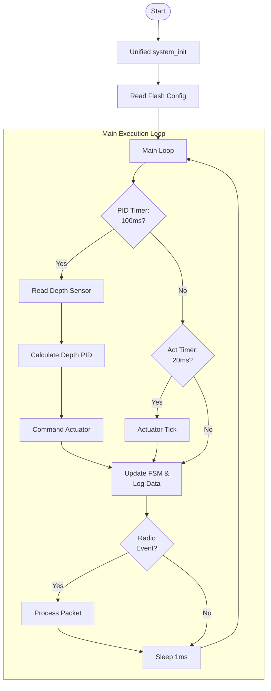
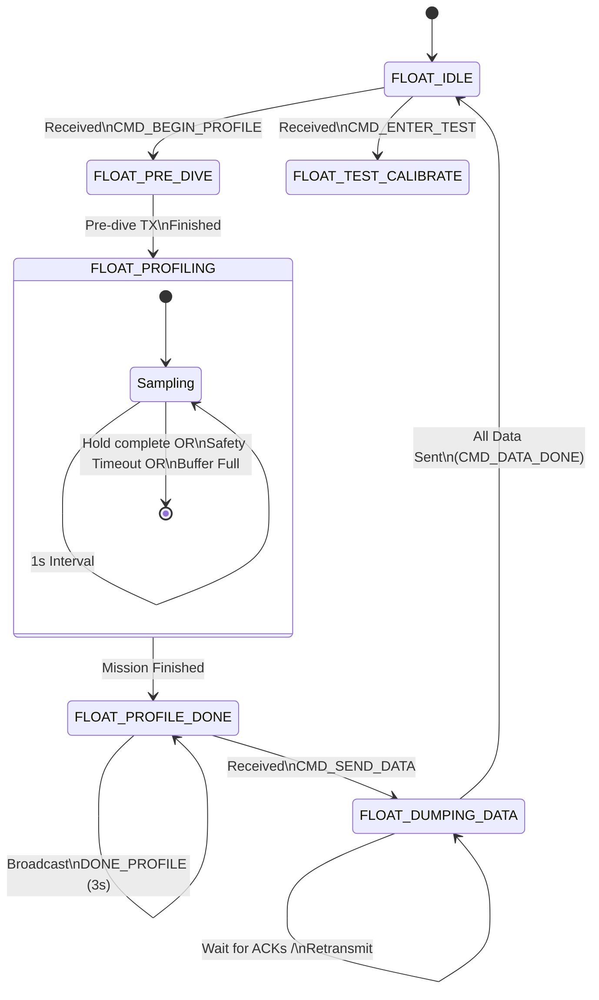

# Float Unit (Underwater) Architecture

This document describes the software architecture for the underwater float, including its program flow and state machine logic.

---

## 1. Float Program Flow (Main Loop)

The float firmware uses a unified boot sequence followed by a multi-rate control loop.

### Control Rates
- **Depth PID (10Hz)**: Calculates the required buoyancy adjustment based on target depth.
- **Actuator Loop (50Hz)**: Handles non-blocking motor control, including stall detection and soft-start.
- **State Machine (ASAP)**: Processes incoming radio commands and transitions through mission phases.

---

## 2. Float FSM (State Transitions)

The Float FSM manages the mission lifecycle, from waiting for surface commands to executing the dive profile and surfacing to transfer data.

---

## 3. NeoPixel Status LED

The float uses an on-board NeoPixel (GPIO 16) to provide immediate visual feedback of its internal state. This is driven by the RP2040's hardware PIO (Programmable I/O) to ensure timing does not interfere with time-critical PID control.

| State | Color | Description |
| :--- | :--- | :--- |
| **IDLE** | 🟢 **Green** | Ready and waiting for commands from the Surface Station. |
| **PRE_DIVE** | 🟡 **Yellow** | Transmitting starting telemetry packet. |
| **PROFILING** | 🔵 **Blue** | **Autonomous PID active.** Actively managing depth. |
| **PROFILE_DONE** | 💠 **Cyan** | Mission finished; surfaced and broadcasting beacon. |
| **DUMPING_DATA** | 🟣 **Magenta** | Transferring high-resolution data log to Surface. |
| **TEST_MODE** | ⚪ **White** | Live streaming depth/ADC for real-time calibration. |
| **ERROR** | 🔴 **Red** | System error or unexpected FSM state transition. |

---

## 4. Implementation Details

- **Unified Boot**: `system_init()` handles the deterministic startup of Serial, Storage (LittleFS), I2C, MS5837 Sensor, and the SX1276 Radio.
- **Safety Overrides**: Implements 1-second stall detection and 8-second total movement timeout to protect the buoyancy mechanism.
- **Persistent Storage**: Mission parameters (PID, bounds, depth offset) are saved to internal flash.
- **Checksum Verification**: Every incoming packet is validated using an XOR checksum.
