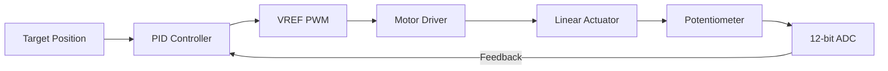

# Hardware Specifications

This document defines the physical layer, hardware constraints, and peripheral configurations for the X18-Float system based on the RP2040 (Raspberry Pi Pico / Adafruit Feather).

---

## 1. Primary Pinout (RP2040)

The system is optimized for the Adafruit Feather RP2040 form factor, but applies to standard Pico boards.

| Function | GPIO | Label | Description |
| :--- | :--- | :--- | :--- |
| **I2C1 SDA** | 2 | SDA | Data line for depth and IMU sensors |
| **I2C1 SCL** | 3 | SCL | Clock line for sensors |
| **SPI0 SCK** | 18 | SCK | SPI Clock for LoRa Radio |
| **SPI0 MOSI** | 19 | MO | SPI Data Out for Radio |
| **SPI0 MISO** | 20 | MI | SPI Data In for Radio |
| **Radio CS** | 24 | 24 | Chip Select (Active LOW) |
| **Radio RST** | 25 | 25 | Reset line (Active LOW) |
| **Radio EN** | 8 | 8 | Power Enable (High = ON) |
| **Radio IRQ** | 9 | 9 | Hardware Interrupt (Active HIGH) |
| **Actuator POT**| 26 | A0 | Feedback (ADC0, 0-4095) |
| **Actuator EXT**| 12 | 12 | H-Bridge: Extension |
| **Actuator RET**| 13 | 13 | H-Bridge: Retraction |
| **VREF PWM**   | 27 | A1 | Actuator Speed Control (PWM) |

---

## 2. Peripheral Configuration

### I2C Bus (`i2c1`)
*   **Speed:** 400 kHz (Fast Mode)
*   **Pull-ups:** Internal 50kΩ enabled + External 4.7kΩ recommended.
*   **Devices:**
    *   **MS5837-02BA:** Address `0x76` (Pressure/Depth). Requires high-resolution (OSR 8192) for sub-centimeter accuracy.
    *   **BNO085:** Address `0x4A` (9-DOF IMU). Used for pitch/roll stability monitoring.

### SPI Bus (`spi0`)
*   **Speed:** 8 MHz
*   **Device:** SX1276 LoRa Radio.

### LoRa Radio (SX127x)
*   **Frequency:** 915.0 MHz (US ISM Band)
*   **Bandwidth:** 125.0 kHz
*   **Spreading Factor (SF):** 7 (Balanced speed/range)
*   **Coding Rate:** 4/5
*   **Power Enable:** GPIO 8 MUST be pulled HIGH to enable the 3.3V regulator for the radio.

---

## 3. Actuator Control Logic

The buoyancy engine uses a linear actuator with a feedback potentiometer.

### Control Loop

### Motor Driver Logic (H-Bridge)
| EXT (GPIO 12) | RET (GPIO 13) | Action |
| :---: | :---: | :--- |
| HIGH | LOW | Extend (Increase Volume) |
| LOW | HIGH | Retract (Decrease Volume) |
| LOW | LOW | Stop |
| HIGH | HIGH | **INVALID** (Brake/Short) |

### Feedback Mapping
*   **ADC Range:** 0 to 4095.
*   **Position Tolerance:** ±41 counts (~1% error) to prevent motor jitter (hunting).
*   **Safety Timeout:** 8 seconds per movement to prevent battery drain on jam.

---

## 4. Electrical Constraints
*   **Logic Level:** 3.3V (All pins).
*   **Peak Current:** Actuator can draw up to 1.5A during heavy load; ensure battery and decoupling capacitors are sufficient.
*   **ADC Reference:** 3.3V (Hardware VREF).
