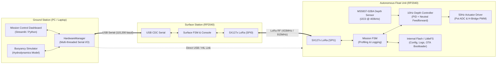
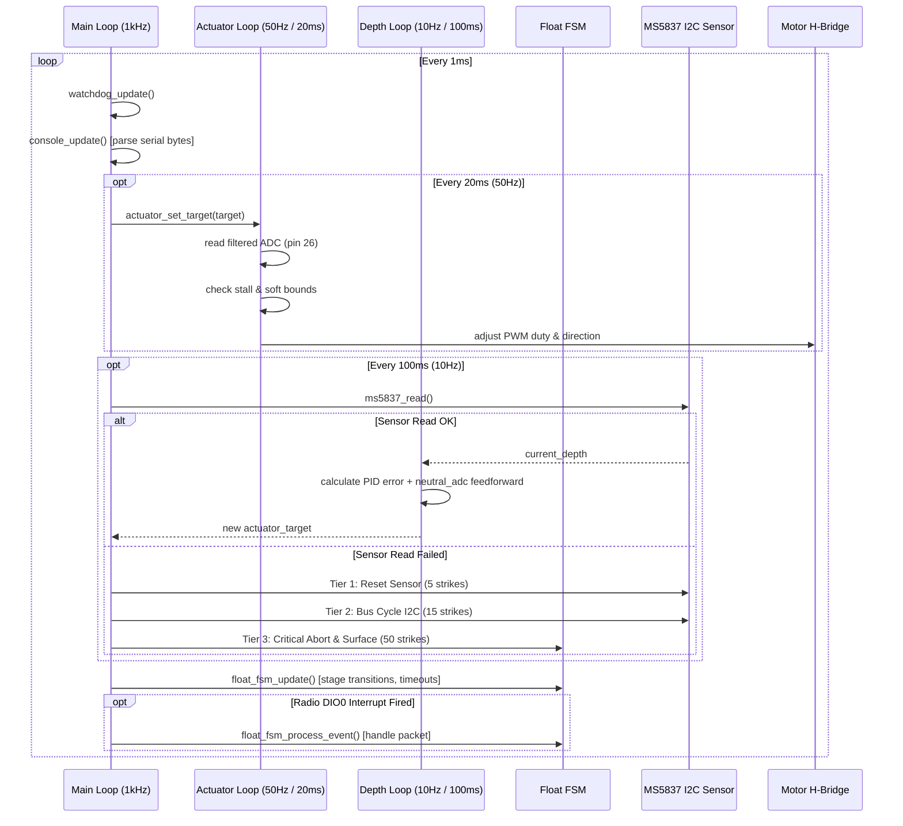
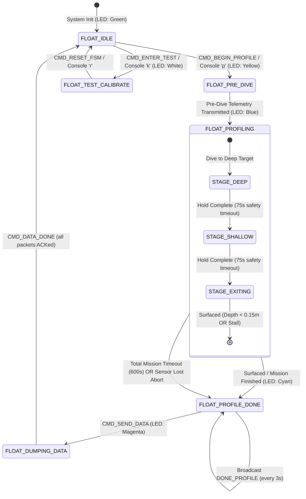
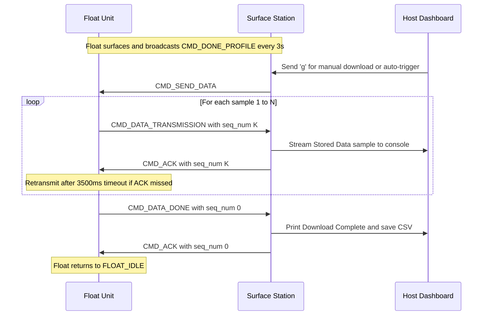

# X18-Float Embedded Software Architecture & Data Flow Deep Dive

This document provides a comprehensive, component-level reference for the X18-Float system. It covers the firmware architecture, data flow pathways, state machine transitions, buoyancy physics, radio communication protocols, OTA bootloader design, and the engineering rationale ("the why") behind each architectural decision.

---

## 1. System Topology & Operational Roles



### Why a Two-Microcontroller Split?
- **Water RF Attenuation:** High-frequency RF signals (433/915 MHz LoRa) attenuate rapidly in water (effectively 0m range once fully submerged).
- **Decoupled Gateway:** The **Surface Station** stays above water attached to the laptop via USB, acting as a bidirectional bridge. The **Float Unit** operates fully autonomously once underwater and establishes radio contact only when surfaced or during pre-dive staging.

---

## 2. Microcontroller Architecture & Resource Mapping

Both the Float and Surface station use the **Raspberry Pi Pico (RP2040)** running dual ARM Cortex-M0+ cores @ 133MHz with 264KB SRAM and 2MB/8MB QSPI Flash.

### Hardware Mapping Table

| Subsystem | Peripheral | Float GPIO | Surface GPIO | Rationale / Design Notes |
| :--- | :--- | :--- | :--- | :--- |
| **LoRa Radio** | SPI Peripheral | `spi1` (SCK: 10, MOSI: 11, MISO: 12) | `spi0` (SCK: 18, MOSI: 19, MISO: 16) | Separated SPI buses prevent pin clashes with actuator ADC and sensor I2C. |
| **LoRa Control** | GPIO | CS: 3, RST: 15, DIO0: 20 | CS: 17, RST: 14, DIO0: 21 | DIO0 configured as rising-edge interrupt for packet arrival (RX) and TX complete. |
| **Depth Sensor** | `i2c0` | SDA: 8, SCL: 9 (400kHz) | N/A | MS5837-02BA piezoresistive pressure sensor (0.02 mbar resolution). |
| **Actuator Motor** | PWM / GPIO | EXT: 6, RET: 7 | N/A | H-Bridge driver with hardware deadband prevention to avoid shoot-through. |
| **Potentiometer**| ADC Channel 0 | Pin 26 (ADC0, 12-bit) | N/A | Measures linear position of syringe piston (0–4095 ADC counts). |
| **Visual LED** | PIO / WS2812 | PIO0 (Data: 21, Power: 13) | Internal LED (25) | Hardware PIO bit-banging guarantees zero jitter and no CPU interrupts for RGB feedback. |
| **Watchdog** | Hardware Timer | Internal (8,000 ms) | Internal (8,000 ms) | Resets system if any loop hangs or I2C bus wedges. |

---

## 3. Float Unit Multi-Rate Control Loop

The float firmware (`src/float_main.c`) executes a deterministic multi-rate loop inside a single core to eliminate mutex overhead while guaranteeing timing isolation.



### Why Multi-Rate Execution?
1. **Inner Actuator Loop (50Hz / 20ms):** The DC motor drives a lead screw connected to a 90mL syringe. Moving at high speeds requires fast position feedback to prevent mechanical ramming at physical travel limits.
2. **Outer Depth Loop (10Hz / 100ms):** Buoyancy dynamics underwater have significant hydrodynamic inertia. Updating depth PID at 50Hz would amplify high-frequency water turbulence noise and cause motor chatter. 10Hz provides a clean, damped response.

---

## 4. Buoyancy Physics & Hybrid Control Strategy

### The Physics of Buoyancy
Net vertical force $F_{net}$ acting on the float is:
$$F_{net} = F_b - F_g - F_{drag} = \rho(T, P) \cdot g \cdot V_{total}(P, ADC) - m \cdot g - \frac{1}{2} C_d A \rho v |v|$$

- **Piston Retraction (ADC decreases):** Water enters the syringe $\rightarrow$ Total volume $V_{total}$ decreases $\rightarrow$ Buoyancy decreases $\rightarrow$ **Sink**
- **Piston Extension (ADC increases):** Water expelled from syringe $\rightarrow$ Total volume $V_{total}$ increases $\rightarrow$ Buoyancy increases $\rightarrow$ **Rise**

### Why Neutral ADC Feedforward?
Standard PID controllers operating on depth error calculate:
$$u(t) = K_p e(t) + K_i \int e(t) dt + K_d \frac{de(t)}{dt}$$
If output $u(t)$ maps directly to motor command, the float cannot hover when error $e(t) = 0$ unless the integral term slowly accumulates the exact balance position. In underwater vehicles, this causes severe overshoot, oscillations, and integrator windup.

**Our Solution:** The controller computes motor position relative to a calibrated **Neutral Buoyancy ADC Baseline** ($N_{adc} \approx 1850$):
$$\text{Target ADC} = N_{adc} + \text{clamp}(u(t), \text{ActMin} - N_{adc}, \text{ActMax} - N_{adc})$$
- When depth error is 0, the actuator defaults to $N_{adc}$, holding hover equilibrium effortlessly.
- **Adaptive Learning:** While hovering inside the target depth tolerance band, the float averages actual actuator positions:
  $$\overline{ADC}_{hover} = \frac{\sum ADC_{sample}}{K}$$
  Upon surfacing, this learned baseline is written to flash memory, automatically adapting to varying pool water densities and ballast shifts.

---

## 5. Finite State Machine (FSM) Lifecycle

The autonomous mission lifecycle is governed by `lib/fsm/float_fsm.c`:



### Safety & Failsafe Matrix

| Hazard | Detection Mechanism | Autonomous Mitigation |
| :--- | :--- | :--- |
| **Software Hang / Deadlock** | RP2040 Hardware Watchdog | Reboots MCU within 8 seconds into safe bootloader/app state. |
| **Depth Sensor Failure / I2C Stall** | Strike counter on consecutive failed reads | Tier 1: Soft reset sensor (5 strikes). Tier 2: Full I2C bus power cycle (15 strikes). Tier 3: Emergency surface (`act_max`). |
| **Mechanical Syringe Stall** | Motor active but potentiometer ADC delta $< 15$ for $> 1.0\text{ s}$ | Cuts motor drive, marks axis stalled, and prevents H-bridge burnout. |
| **Float Stuck Underwater** | Stall detection: Depth unchanged ($\Delta d < 0.01\text{m}$) for $> 15\text{s}$ | Advances stage or commands full positive buoyancy (`act_max`). |
| **Prolonged Submersion** | Absolute mission timer ($> 600\text{ s}$) | Bypasses all profiling logic, pulls syringe to maximum volume, and surfaces immediately. |
| **Stage Timeout** | Stage elapsed time ($> 75\text{ s}$) | Forces advancement to next stage or surface ascent. |

---

## 6. Communication Protocol & Telemetry Data Flow

### Packet Architecture (`lib/comms/packets.h`)
All radio packets are 40 bytes fixed size, designed for low time-on-air and deterministic SX127x FIFO handling:
- **`command` (1 byte):** Operation code (`CMD_BEGIN_PROFILE`, `CMD_DATA_TRANSMISSION`, `CMD_ACK`, etc.)
- **`seq_num` (2 bytes):** Packet sequence identifier for Stop-and-Wait ARQ.
- **`payload` (32 bytes union):**
  - `telemetry`: Company ID, Timestamp (`ms`), Depth (`m`), Pressure (`kPa`), Actuator ADC, Target ADC.
  - `settings`: PID gains, targets, tolerances, calibration offsets, firmware version.
  - `test_data`: Live depth and ADC stream.
- **`checksum` (4 bytes):** Standard 32-bit CRC (`0xEDB88320` polynomial).

### Radio Collision Avoidance (CAD)
Before transmitting any packet, the radio executes **Channel Activity Detection (CAD)**:
1. Puts SX1276 into CAD mode.
2. If energy/preamble detected on channel, the station aborts transmission and backs off, preventing packet collision.
3. If CAD fails or channel busy, the radio immediately re-enters `RX` mode so incoming commands are never missed.

### High-Resolution Data Dump (Stop-and-Wait ARQ)


---

## 7. Dual-Slot OTA Bootloader & Differential Patching

Opening the waterproof pressure hull in the field degrades rubber O-ring seals, introduces moisture, and wastes valuable pool testing time. The X18-Float features an in-situ **Over-The-Air (OTA) Secondary Bootloader**.

### Flash Partition Layout (2MB RP2040 Flash)

```
0x0000_0000 +------------------------------------------+
            | Bootloader (32 KB)                       |
0x0000_8000 +------------------------------------------+
            | Slot 0: Active Application Firmware      | (Linked at 0x10008000 via app_memmap.ld)
            | (Up to ~992 KB)                          |
0x0010_0000 +------------------------------------------+
            | Slot 1: Staging / Patch Binary           | (Holds incoming bsdiff patch)
            | (1024 KB)                                |
0x0020_0000 +------------------------------------------+
            | Slot 2: LittleFS Configuration & Data    |
            +------------------------------------------+
```

### Why `bsdiff` Differential Patching?
- A full RP2040 application binary is **~150 KB – 220 KB**.
- Over a 9600-baud LoRa link with error checking, transferring 200 KB takes **5 to 8 minutes** and has high probability of packet loss.
- Typical code modifications (tuning a PID loop, changing a timeout) alter only **2 KB – 8 KB** of machine code.
- Using `bsdiff` differential compression, we transmit only the binary diff. The patch stream takes **under 20 seconds** to flash over the air.

### Bootloader Update Handoff Flow
1. **Reflash Host (`reflash_host.c`):** Slices patch binary into 64-byte chunks with sequence numbers and CRC32 checks.
2. **Reflash Target (`reflash_target.c`):** Writes incoming chunks directly into Flash Slot 1 (`0x00100000`).
3. **Trigger:** Once all bytes match the file CRC32, the float writes `OTA_MAGIC` (`0xDEADBEEF`) into `watchdog_hw->scratch[0]` and triggers a watchdog reboot.
4. **Bootloader Execution (`src/bootloader_main.c`):**
   - On boot, checks `watchdog_hw->scratch[0]`.
   - If `OTA_MAGIC`, parses Slot 1 using `bspatch.c`, reading old application code from Slot 0 and generating new binary into RAM/staging.
   - Erases Slot 0 and copies the patched application.
   - Clears `watchdog_hw->scratch[0]`.
5. **Application Jump:** Updates `SCB_VTOR` (Vector Table Offset Register) to `0x00008000`, loads the Stack Pointer from vector 0, and branches to Reset Handler at vector 1.

---

## 8. Front-End Mission Control Architecture

The frontend (`front_end/main.py`) is built using **Streamlit** and an asynchronous multi-threaded hardware driver (`front_end/modules/hardware.py`).

### Thread Isolation Model
```
[ Serial Port Worker Thread ]
           │ (Incoming Byte Stream)
           ▼
   Regex Line Parsers
   - [SYNC]       --> Update self.float_settings
   - [TELEMETRY]  --> Append to self.data_log (deque max 2000)
   - [HIL_OUT]    --> Feed BuoyancySimulator
           │
      with self.lock: (Atomic State Updates)
           ▲
[ Streamlit UI Rendering Thread (Fragment @ 1.0s) ]
   - render_metrics(): Active PID & Depth display
   - render_charts(): Plotly Depth & ADC profiles
   - render_debug_terminal(): Reverse-scrolled color log
```

### Hardware-in-the-Loop (HIL) Simulation Engine (`simulator.py`)
To test control loops, PID tuning, and UI visualization without physical water:
- **Fluid Model:** Computes UNESCO EOS-80 pure water density based on temperature ($20^\circ\text{C}$) and depth-dependent hydrostatic bulk modulus ($K$).
- **Compressibility:** Simulates hull volume contraction ($\beta_p = 3.3 \times 10^{-6}\text{ dbar}^{-1}$) and thermal expansion ($\alpha_v = 6.9 \times 10^{-5}\text{ K}^{-1}$).
- **Hydrodynamic Drag:** Integrates quadratic drag with form coefficient $C_d = 0.82$ and added mass coefficient $C_a = 0.33$.
- **Closed-Loop Feedback:** Floats running in `#ifdef HIL_MODE` receive simulated depth over serial, run real PID calculations, and drive physical actuator motors on the bench.
